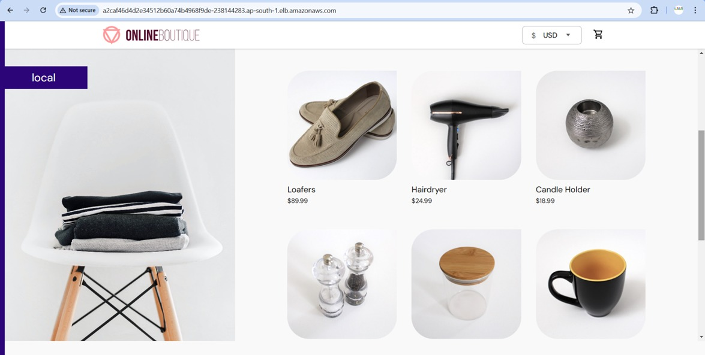

# End-to-End E-Commerce Microservices Built with AWS EKS, Jenkins, Docker, and Kubernetes 🛒🚀

## **Project Overview**  
This project demonstrates how to set up a scalable **microservices architecture** using **AWS**, **Kubernetes (EKS)**, and **Jenkins**. It covers deploying a cluster on AWS EKS, Jenkins integration for CI/CD, and Docker for containerization. 🌟  

---

## **Steps to Set Up the Project** 🛠️

### **Step 1: Setting Up Your EC2 Instance** 💻  
- Launch an EC2 instance with the following specifications:  
  - **Instance Type**: `t2.large`  
  - **Storage**: 30GB EBS  
  - **Permissions**: IAM full access  

---

### **Step 2: Install Required Tools** 🔧  
1. **Install AWS CLI**:  
    ```bash
    curl "https://awscli.amazonaws.com/awscli-exe-linux-x86_64.zip" -o "awscliv2.zip"
    sudo apt install unzip -y
    unzip awscliv2.zip
    sudo ./aws/install
    ```  
2. **Install kubectl**:  
    ```bash
    curl -o kubectl https://amazon-eks.s3.us-west-2.amazonaws.com/1.19.6/2021-01-05/bin/linux/amd64/kubectl
    chmod +x ./kubectl
    sudo mv ./kubectl /usr/local/bin
    kubectl version --short --client
    ```  
3. **Install eksctl**:  
    ```bash
    curl --silent --location "https://github.com/weaveworks/eksctl/releases/latest/download/eksctl_$(uname -s)_amd64.tar.gz" | tar xz -C /tmp
    sudo mv /tmp/eksctl /usr/local/bin
    eksctl version
    ```

---

### **Step 3: Configure AWS Credentials** 🔐  
- Run the following command and provide the IAM user's credentials:  
    ```bash
    aws configure
    ```  

---

### **Step 4: Create an EKS Cluster** 🛡️  
1. **Create the cluster**:  
    ```bash
    eksctl create cluster --name=EKS-1 --region=ap-south-1 --zones=ap-south-1a,ap-south-1b --without-nodegroup
    ```  
2. **Associate IAM OIDC Provider**:  
    ```bash
    eksctl utils associate-iam-oidc-provider --region ap-south-1 --cluster EKS-1 --approve
    ```  
3. **Add a node group**:  
    ```bash
    eksctl create nodegroup --cluster=EKS-1 --region=ap-south-1 \
      --name=node2 --node-type=t3.medium --nodes=3 --nodes-min=2 --nodes-max=4 \
      --node-volume-size=20 --ssh-access --ssh-public-key=DevOps --managed \
      --asg-access --external-dns-access --full-ecr-access --appmesh-access \
      --alb-ingress-access
    ```

---

### **Step 5: Install Jenkins and Docker** 🐳  
1. **Install Jenkins**:  
    ```bash
    sudo apt install openjdk-17-jre-headless -y
    sudo wget -O /usr/share/keyrings/jenkins-keyring.asc https://pkg.jenkins.io/debian-stable/jenkins.io-2023.key
    echo "deb [signed-by=/usr/share/keyrings/jenkins-keyring.asc] https://pkg.jenkins.io/debian-stable binary/" | sudo tee /etc/apt/sources.list.d/jenkins.list > /dev/null
    sudo apt-get update
    sudo apt-get install jenkins -y
    ```  
2. **Install Docker**:  
    ```bash
    sudo apt install docker.io -y
    sudo chmod 777 /var/run/docker.sock
    ```

---

### **Step 6: Install Jenkins Plugins** ⚙️  
- Navigate to **Dashboard > Manage Jenkins > Plugins** and install the following:  
  - Docker  
  - Docker Pipeline  
  - Kubernetes  
  - Kubernetes CLI  

- **Configure Docker in Jenkins**:  
  - Go to **Dashboard > Manage Jenkins > Tools > Docker Installations**  
  - Set the name as `docker` and version as `latest`.  

---

### **Step 7: Add Jenkins Credentials** 🔑  
1. Add Docker credentials:  
    - **Username**: `lalitmahajan`  
    - **Password**: `********`  
    - **ID**: `docker`  

---

### **Step 8: Set Up Kubernetes Namespace, Service Account, Role, and RoleBinding** 🌐  
1. **Create a namespace** named `webapps`.  
2. **Create a ServiceAccount** for Jenkins in the `webapps` namespace.  
3. Define and apply a **Role** with necessary permissions in the `webapps` namespace.  
4. Bind the **Role** to the ServiceAccount using a **RoleBinding**.  
5. Generate a **token** using the ServiceAccount in the `webapps` namespace.  

---

### **Step 9: Add Kubernetes Token to Jenkins** 🛡️  
- Add the token as a **secret** in Jenkins credentials with ID: `k8s-token`.  

---

### **Step 10: Update Repository Details** 🗂️  
1. **Clone the repository**:  
    ```bash
    git clone https://github.com/Lalit-Mahajan/microservices-project.git
    ```  
2. Update the DockerHub ID, token, and endpoint in the main branch.  

---

## **Repository**  
- 🌟 [Microservices Project GitHub Repo](https://github.com/Lalit-Mahajan/microservices-project.git)  

---

### **OUTPUT: 🎯**  
🚀 *Your microservices-based e-commerce application is live!*  
📸 **Here's a glimpse of the Online Boutique**:  
  
